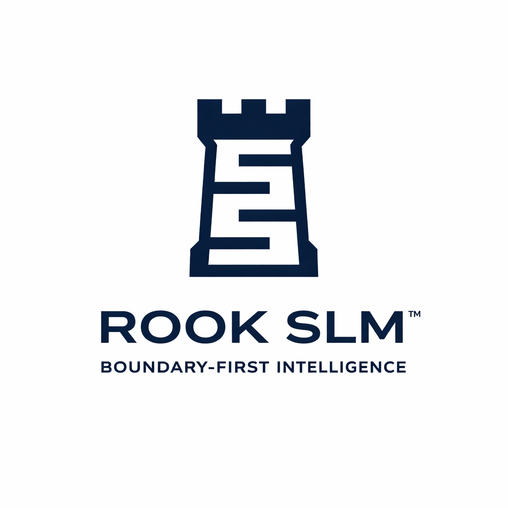

<p align="center">
  
</p>

# ROOK SLM™ Framework
 
**Boundary-First Intelligence for Secure, Governed Small Language Model Architecture**

ROOK SLM™ is a public reference framework for designing secure, governable, local-first or edge-capable Small Language Model (SLM) systems. It emphasizes controlled context, clear trust boundaries, policy-aware orchestration, and practical AI governance for enterprise and regulated environments.

> ROOK SLM™ is presented as a professional architectural framework by Kris B., supporting advisory, architecture, and AI posture assessment work.

## Purpose

This repository provides public-facing materials for explaining the ROOK SLM™ approach without exposing proprietary implementation details, customer-specific designs, operational controls, or sensitive security logic.

Use this repo to understand:

- Boundary-first AI architecture principles
- Secure SLM design considerations
- Controlled API orchestration patterns
- Persona-based AI system design at a conceptual level
- Governance, auditability, and compliance considerations
- Advisory engagement and AI posture assessment templates

## Repository Structure

```text
/docs
  rook-slm-overview.md
  boundary-first-intelligence.md
  reference-architecture.md
  governance-model.md
  controlled-api-orchestration.md
  persona-routing-concept.md
  roadmap.md
/templates
  ai-posture-assessment-template.md
  advisory-engagement-outline.md
  architecture-review-checklist.md
  governance-readiness-checklist.md
/diagrams
  README.md
/assets
  README.md
LICENSE
NOTICE.md
SECURITY.md
CONTRIBUTING.md
```

## What This Repository Is

This is a public, sanitized reference architecture and advisory resource.

It is intended for:

- Executives evaluating AI governance posture
- Architects designing secure AI systems
- Cybersecurity leaders assessing AI risk
- Technical teams exploring SLM deployment models
- Professional portfolio and thought-leadership use

## What This Repository Is Not

This repository does **not** include:

- Production source code
- Private system prompts
- Proprietary persona-routing logic
- Customer-specific architecture artifacts
- Secrets, credentials, or environment files
- Detailed exploit, bypass, or abuse workflows
- Internal company materials
- Operational deployment instructions for sensitive environments

## Core Principles

1. **Boundaries before intelligence**  
   AI systems should define trust boundaries before expanding capability.

2. **Context is a controlled asset**  
   Retrieval, memory, and prompt context should be scoped, governed, and auditable.

3. **APIs extend risk surface**  
   External tools and APIs should be selectively exposed, policy-gated, and logged.

4. **Personas require governance**  
   Persona routing should align with business purpose, access control, and audit requirements.

5. **Local-first where appropriate**  
   Local and edge inference can reduce exposure, but must still be governed.

6. **Auditability is architecture**  
   Logging, traceability, and policy-aware decision records are first-class design concerns.

## Suggested Reading Path

1. [ROOK SLM Overview](docs/rook-slm-overview.md)
2. [Boundary-First Intelligence](docs/boundary-first-intelligence.md)
3. [Reference Architecture](docs/reference-architecture.md)
4. [Governance Model](docs/governance-model.md)
5. [Controlled API Orchestration](docs/controlled-api-orchestration.md)
6. [Persona Routing Concept](docs/persona-routing-concept.md)
7. [Roadmap](docs/roadmap.md)

## Professional Use

ROOK SLM™ can support advisory work such as:

- AI posture assessments
- Secure AI architecture reviews
- SLM readiness workshops
- Governance model development
- Controlled API orchestration planning
- Board-level AI risk briefings
- Executive education on boundary-first AI design

## Status

This repository is intended as a public framework and professional portfolio asset. It should remain sanitized and conceptual unless explicitly converted into a private implementation repository.

## Trademark Notice

ROOK SLM™ and Boundary-First Intelligence™ are used as brand identifiers by Kris B. See [NOTICE.md](NOTICE.md).

---

<p align="center">
  
</p>
